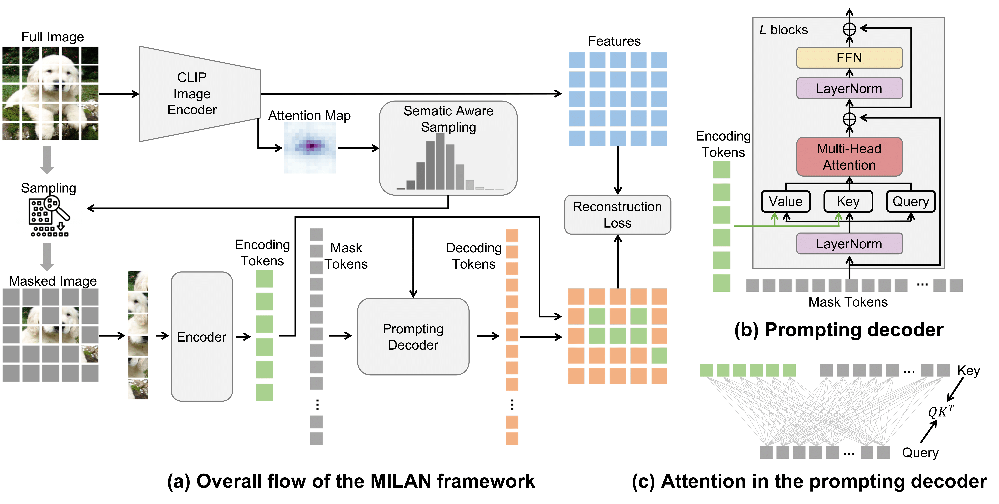

# MILAN: Masked Image Pretraining on Language Assisted Representation

This repository contains the PyTorch implementation of the paper [MILAN: Masked Image Pretraining on Language Assisted Representation](https://arxiv.org/pdf/2208.06049.pdf).

<div align="center">
  
</div>

* This repo was built upon the [MAE repo](https://github.com/facebookresearch/mae). Installation and preparation follow that repo.

### Prepare the dataset

* We use ImageNet-1K. [Download the images](http://image-net.org/download-images).

* Extract the training data:
```Shell
mkdir train && mv ILSVRC2012_img_train.tar train/ && cd train
tar -xvf ILSVRC2012_img_train.tar && rm -f ILSVRC2012_img_train.tar
find . -name "*.tar" | while read NAME ; do mkdir -p "${NAME%.tar}"; tar -xvf "${NAME}" -C "${NAME%.tar}"; rm -f "${NAME}"; done
cd ..
```

* Extract the validation data and move the images to subfolders:
```Shell
mkdir val && mv ILSVRC2012_img_val.tar val/ && cd val && tar -xvf ILSVRC2012_img_val.tar
wget -qO- https://raw.githubusercontent.com/soumith/imagenetloader.torch/master/valprep.sh | bash
```

### Pretraining
Example of applying MILAN to pretrain ViT-B/16 on ImageNet-1K using 8 GPUs:

```Shell
python -m torch.distributed.launch --nproc_per_node=8 --use_env main_pretrain.py \
    --model mae_vit_base_patch16 \
    --batch_size 256 \
    --accum_iter 2 \
    --mask_ratio 0.75 \
    --epochs 400 \
    --warmup_epochs 40 \
    --blr 1.5e-4 \
    --weight_decay 0.05 \
    --data_path /dataset/imagenet \
    --output_dir ./milan_vit_base_pretrain_400epoch_useclip_changedecoder_attnmask \ 
    --log_dir ./milan_vit_base_pretrain_400epoch_useclip_changedecoder_attnmask \
    --use_clip \
    --change_decoder \
    --attn_mask
```

* The available `--model` choices are listed in `models_milan.py`.
* Effective batch size is 256 (`--batch_size` per GPU) * 2 (`--accum_iter` gradient accumulation) * 8 (GPUs) = 4096.
* Effective learning rate is 1.5e-4 (`--blr` base learning rate) * 4096 (effective batch size) / 256 = 2.4e-3.
* `--mask_ratio`: percentage of patches to remove.
* `--epochs`: total pretraining epochs, `--warmup_epochs`: learning rate warmup epochs.
* We apply `--weight decay` of 0.05 during pretraining.
* We use the ViT-B/16 CLIP image encoder obtained from [here](https://openaipublic.azureedge.net/clip/models/5806e77cd80f8b59890b7e101eabd078d9fb84e6937f9e85e4ecb61988df416f/ViT-B-16.pt) to produce the reconstruction targets during pretraining.
* `--change_decoder`: switch to the prompting decoder.
* `--attn_mask`: switch to the semantic aware masking strategy.
* Training time is ~39h using 8 40GB A100 GPUs for 400 epochs.

### Finetuning and linear probing

* Example of finetuning the pretrained ViT-B/16 on ImageNet-1K:

```Shell
OMP_NUM_THREADS=1 python -m torch.distributed.launch --nproc_per_node=8 main_finetune.py \
    --accum_iter 1 \
    --batch_size 128 \
    --model vit_base_patch16 \
    --finetune ./milan_vit_base_pretrain_400epoch_useclip_changedecoder_attnmask/checkpoint-399.pth \
    --epochs 100 \
    --blr 1e-4 --layer_decay 0.65 \
    --weight_decay 0.05 --drop_path 0.1 --mixup 0.8 --cutmix 1.0 --reprob 0.25 \
    --dist_eval --data_path /data/imagenet \
    --output_dir ./milan_vit_base_finetune_pretrain400epochuseclipchangedecoderattnmask \ 
    --log_dir ./milan_vit_base_finetune_pretrain400epochuseclipchangedecoderattnmask \
    --global_pool
```

* Example of performing linear probing on the pretrained ViT-B/16:

```Shell
OMP_NUM_THREADS=1 python -m torch.distributed.launch --nproc_per_node=8 main_linprobe.py \
    --accum_iter 1 \
    --batch_size 2048 \
    --model vit_base_patch16 \
    --cls_token \
    --finetune ./milan_vit_base_pretrain_400epoch_useclip_changedecoder_attnmask/checkpoint-399.pth \
    --epochs 100 \
    --blr 0.05 \
    --weight_decay 0.0 \
    --dist_eval --data_path /data/imagenet \
    --output_dir ./milan_vit_base_linearprobe_pretrain400epochuseclipchangedecoderattnmask \
    --log_dir ./milan_vit_base_linearprobe_pretrain400epochuseclipchangedecoderattnmask

```

### Checkpoints
We provide the pretrained ViT-B/16 and ViT-L/16 checkpoints.

<table>
  <tr>
    <th></th>
    <th>ViT-Base</th>
    <th>ViT-Large</th>
  </tr>
  <tr>
    <td>Pretrained checkpoint</td>
    <td><a href="https://drive.google.com/file/d/18UYGG_1r5SJyAgj1ykOfoqECdVBoFLoz/view?usp=sharing">download</a></td>
    <td><a href="https://drive.google.com/file/d/1bODIriEMq6RgnTUyy4i4tfOr0DgzfVW3/view?usp=sharing">download</a></td>   
  </tr>
</table>

### Citation
If you find this repository helpful, please consider citing:
```Shell
@article{MILAN2022,
  title   = {MILAN: Masked Image Pretraining on Language Assisted Representation},
  author  = {Hou, Zejiang and Sun, Fei and Chen, Yen-Kuang and Xie, Yuan and Kung, Sun-Yuan},
  journal = {arXiv preprint arXiv:2208.06049},
  year    = {2022},
}
```


